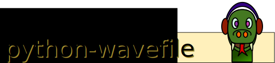

# 

[](https://github.com/vokimon/python-wavefile/actions/workflows/main.yml)
[](https://coveralls.io/r/vokimon/python-wavefile?branch=master)
[](https://pypi.python.org/pypi/wavefile)
[](https://pypi.python.org/pypi/wavefile)

Pythonic libsndfile wrapper to read and write audio files.

Features
--------

- Wave file resources allocated as context managers (`with`)
- Format, channels, length, sample rate... are accessed as properties
- Real multichannel (not just mono/stereo, surround, ambisonics and virtually any number of channels)
- All libsndfile formats supported, floating point encodings by default
- Numpy based interface
- Generators for block by block access (streaming without loading the full audio into memory)
- Reading reuses the same data block to avoid many data allocations
- Matlab-like whole-file interface (not recommended in production code but quite convenient for quick scripting)
- Shortened constant names for formats (Using namespaces instead of prefixes)
- Transparent UTF-8 handling for filenames and text strings
- No module compilation required (wraps the dll using ctypes)
- Compatible with Python >= 2.6 including Python3

You can find the latest version at:
https://github.com/vokimon/python-wavefile


- [Version history](CHANGES.md)
- [Wish list](TODO.md)
- [Installation](#installation)
- [Examples](#examples)
  - [Writing example](#writing-example)
  - [Playback example (using PyAudio)](#playback-example-using-pyaudio)
  - [Processing example](#processing-example)
  - [Whole file (slow) processing](#whole-file-slow-processing)


Installation
------------

[](https://pypi.python.org/pypi/wavefile/)
[](https://pypi.python.org/pypi/wavefile/)

### Binary dependencies

Python dependencies are managed by the setup.py script.
But still there are a couple of binary dependencies.
In Debian/Ubuntu, you can install them by casting:

```bash
sudo apt-get install -y libsndfile1 portaudio19-dev
```
PortAudio and its Python wrapper, PyAudio, are just required in order to run the examples.

### Using PyPi

```bash
pip install wavefile
```

### From sources

A setup.py script is provided so the common procedure for
installing python packages in you platfrom will work.
For example in Debian/Ubuntu systems:

```bash
python setup.py install
```

Examples
--------

### Whole file (slow) processing

This is the quick and dirty way (mathlab like) of reading and saving audio.

While is quite convenient to get things done,
DO NO USE IT, if you are concerned with performance.

```python
import wavefile
import numpy as np

def sinusoid(samples, f, samplerate=44100):
    return np.sin( np.linspace(0, 2*np.pi*f*samples/samplerate, samples))[:,np.newaxis]

def channels(*args):
    return np.hstack(args).T


audio = channels(
    sinusoid(100000,  440),
    sinusoid(100000,  880),
    sinusoid(100000, 1760),
)

wavefile.save("sinusoid.wav", audio, 44100)

loadedsamplerate, loaded = wavefile.load("sinusoid.wav")

loaded.shape() # 3, 100000

```


### Writing example

```python
from wavefile import WaveWriter, Format
import numpy as np

BUFFERSIZE = 512
NCHANNELS = 2

with WaveWriter('synth.ogg',
		channels=NCHANNELS,
		format=Format.OGG|Format.VORBIS,
		) as w:
	w.metadata.title = "Some Noise"
	w.metadata.artist = "The Artists"
	data = np.zeros((NCHANNELS,BUFFERSIZE), np.float32)
	for x in range(256):
		# First channel: Saw wave sweep
		data[0,:] = (x*np.arange(BUFFERSIZE, dtype=np.float32)%BUFFERSIZE/BUFFERSIZE)
		# Second channel: Modulated square wave
		data[1,BUFFERSIZE-x*2:] =  1
		data[1,:BUFFERSIZE-x*2] = -1

		# Write it down
		w.write(data)
```

### Playback example (using pyaudio)

```python
import pyaudio, sys
from wavefile import WaveReader

p = pyaudio.PyAudio()
with WaveReader(sys.argv[1]) as r:

	# Print info
	print "Title:", r.metadata.title
	print "Artist:", r.metadata.artist
	print "Channels:", r.channels
	print "Format: 0x%x"%r.format
	print "Sample Rate:", r.samplerate

	# open pyaudio stream
	stream = p.open(
			format = pyaudio.paFloat32,
			channels = r.channels,
			rate = r.samplerate,
			frames_per_buffer = 512,
			output = True)

	# iterator interface (reuses one array)
	# beware of the frame size, not always 512, but 512 at least
	for frame in r.read_iter(size=512):
		stream.write(frame.flatten(), frame.shape[1])
		sys.stdout.write("."); sys.stdout.flush()

	stream.close()
```

### Processing example

```python
import sys
from wavefile import WaveReader, WaveWriter

with WaveReader(sys.argv[1]) as r:
	with WaveWriter(
			'output.wav',
			channels=r.channels,
			samplerate=r.samplerate,
			) as w:
		w.metadata.title = r.metadata.title + " II"
		w.metadata.artist = r.metadata.artist

		for data in r.read_iter(size=512):
			sys.stdout.write("."); sys.stdout.flush()
			w.write(.8*data)
```

While `read_iter` is simpler and recommended,
you can still use the read function,
which is closer to the C one.

```python
import sys, numpy as np
from wavefile import WaveReader, WaveWriter

with WaveReader(sys.argv[1]) as r:
	with WaveWriter(
			'output.wav',
			channels=r.channels,
			samplerate=r.samplerate,
			) as w:
		w.metadata.title = r.metadata.title + " II"
		w.metadata.artist = r.metadata.artist

		data = np.zeros((r.channels,512), np.float32, order='F')
		nframes = r.read(data)
		while nframes:
			sys.stdout.write("."); sys.stdout.flush()
			w.write(.8*data[:,:nframes])
			nframes = r.read(data)
```

Notice that with ```read``` you have to reallocate the data yourself,
the loop structure is somewhat more complex,
and you have to slice to the actual ```nframes``` because
the last block usually does not have the size you asked for.
```read_iter``` simplifies the code by transparently
allocating the data block for you, reusing it for each block
and slicing it when the last incomplete block arrives.


Existing alternatives (what i like and dislike)
-----------------------------------------------

This is 'yet another' wrapper for sndfile.
A lot of them appeared just because the standard
'wave' module is quite limited on what and how it does.
But none of the wrappers I found around fully suit my
needs and that's because I wrote this small and incomplete one,
to fit my needs.
So this is a summary of what I found, just in case it is useful to anyone.

- Standard 'wave' module:
	- http://docs.python.org/library/wave.html
	- I think this is the main reason why there are many
	  wrappers around. The standard module to do wave file
	  loading is crap.
	- Based on sndfile but it just writes .wav files.
	- It lacks support for floating point samples, patch provided
	  but ignored see http://bugs.python.org/issue1144504
	- unreadable getX() methods instead of properties.
	- no numpy integration
	- generators, context managers... what?
	- no whole-file shortcuts provided

- scikits.audiolab
	- git clone https://github.com/cournape/audiolab
	- Cython based + python layer
	- Dual interface: matlab like and OO
	- Property accessors to samplerate...
	- Numpy integration
	- Inplace processing
	- Not in Ubuntu
	- Within a big library

- pysndfile
	- http://savannah.nongnu.org/projects/pysndfile/
	- Swig based wrapper.
	- Direct lib library + python object wrappers
	- Unusable because it is not finished (empty read/write methods in wrapper!)

- libsndfile-python
	- http://code.google.com/p/libsndfile-python/
	- svn checkout http://libsndfile-python.googlecode.com/svn/trunk/ libsndfile-python-read-only
	- Implemented in CPython
	- numpy support
	- cpython purely wraps the library
	- wrappers build the interface
	- double layered lib and pythonic interface (not that pythonic but supports numpy)
	- Implements 'command' sndfile interface

- libsndfilectypes
	- http://code.google.com/p/pyzic/wiki/LibSndFilectypes
	- ctypes based wrapper: no compilation required
	- numpy supported
	- Windows only setup (fixable)
	- Long access to constants
	- Not inplace read (creates an array every time)


python-wavefile reuses most of the libsndfilectypes ctypes wrapper,
as not requiring module compilation was seen as a good point.
A pythonic layer was added on the top of it.


